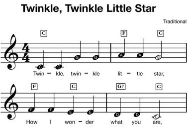
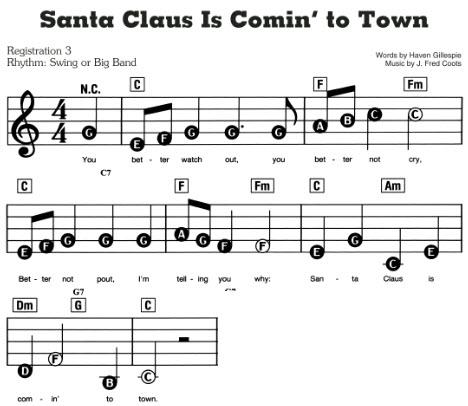

# Text to MIDI



```
4C C G G A A 2G 4F F E E D D 2C
```

```
4C C G G | A A 2G |
4F F E E | D D 2C |
```



```
4G |
; You

8E F 4G 4.G  | 8G A B 4C+ 2C |
; Better watch out, you better not cry.

8E- F 4G G G | 8A G 4F 2F    | 4E G C E | 
; Better not pout, I'm telling you why: Santa Claus is

D 2F 4B-     | 2C+ 2R        |
; comin' to town.
```

  * Octaves
  * Parallel notes
  * Sharps and Flats
  * Ties
  * staccato and slurs
  * tempo
  * Multiple tracks

# Format

Underscores are ignored. You may use them to separate fields as desired. Blank lines are ignored.
Everything after a ";" on a line is ignored (the comment character).

The "|" pipe character can be used to separate measures. Currently these are ignored. They can be
used for future (optional) beats-per-measure checking.

## Tracks and Channels

A track may be assigned to one of 16 MIDI channels. By default, all tracks are assigned to channel 0.

A music score can include several tracks that are played at the same time. Tracks begin with a track-label line like:

```
Track 0:
```

By default, the score begins with "Track 0:" if not specified.

A complex example:

```
>4.~G#+:E#:C#+
```

A colon starts a parallel note. All parallel notes have the same accent, length, and tie (everything to the left of the note name). Only the note and octave (everything to the right of the note) can change.

```
>      4.     ~   G    #          +
ACCENT_LENGTH_TIE_NOTE_ACCIDENTAL_OCTAVE
```

Only the NOTE (name of the note) is required.

## Accent (optional -- defaults to normal)
  * ">" Accent
  * "." Staccato
  * "-" Tenuto
  * "^" Marcato

## Length (optional -- defaults to last length)
  * Number (1=whole, 2=half, 4=quarter, 8=eighth, etc.)
  * one or more dots
  * "t" Tripplet
  * "d" Doublet

## Tie (optional -- defaults to "not tied")
  * Exactly one "~" added to the length indicates the note ties into the next (must be the same note)

## Note (REQUIED)
  * Letters C, D, E, F, G, A, B, and R (for rest)

## Accidentals (optional)
  * "#" for sharp
  * "b" for flat
  * "n" for natural (when key signature is supported)

## Octave (optional -- defaults to last octave)
  * One or more "+" to add to the current octave
  * One or more "-" to subtract from the current octave
  * An absolute octave number (0 for Midi note 21 piano A0 through 9 for Midi note 127 G9)

# Special Commands

These must be lines by themselves

```
:Channel 0             ; [0] Gives the midi channel
:Time 4/4              ; [4/4] Standard music time signature
:Tempo 4=100           ; [120] Quarter note = 100
:Voice 41              ; [0=Acoustic grand piano] Midi-patch-name or number
:Octave 4              ; Octave 4
:Sharp F,G,A,C         ; List sharps
:Flat B,E              ; List flats
:Volume N              ; Set the volume (percent)
:p :f :mp :mf :pp :ff  ; Dynamics
:>   ::  :<            ; crescendo start, cres/dim end, diminuendo start
```